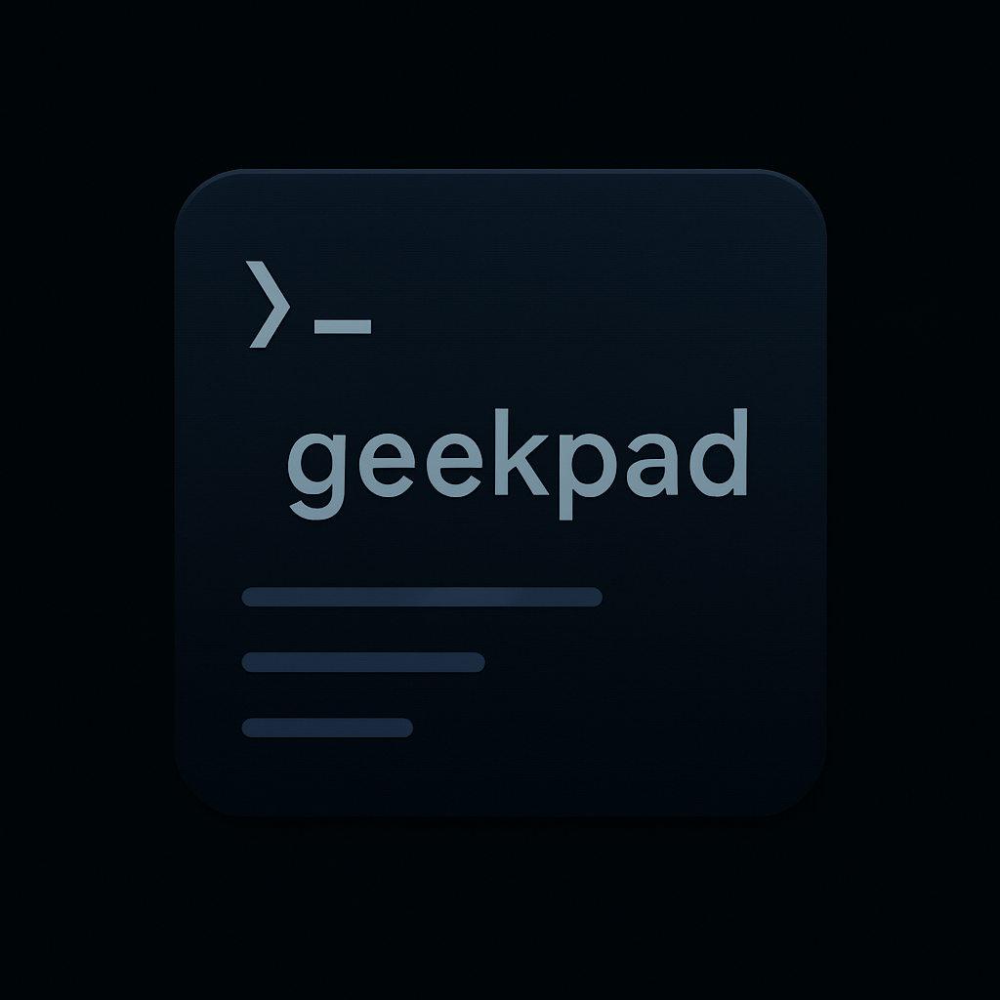

# GeekPad



**GeekPad** is a secure, minimalist, CLI notepad built with Rust. It runs completely offline and is designed for developers, writers, and privacy-conscious users who want a modern, beautiful command-line notes experience —  just focus.

---

## ✨ Features

- 🔐 Secure offline storage
- 📝 Live command parsing (`/bold`, `/alldone`, etc.)
- 🧠 Tamper-proof note signing (Dilithium / PQC-ready)
- 🚫 No tracking, ads, telemetry, or internet required

---

## 🚀 Getting Started

```bash
# Clone the repo
git clone https://github.com/Eswar-S-Sethu/geekpad.git
cd geekpad

# Build the release version
cargo build --release

# Run it
./target/release/geekpad
```

---

## 🔧 Slash Commands

| Command       | Description                     |
|---------------|---------------------------------|
| `/bold`       | Toggles bold mode               |
| `/emoji`      | Enables emoji entry mode        |
| `/alldone`    | Finalizes and saves the note    |
| `/fontcolor`  | Changes the font color          |
| `/fontsize`   | Sets the font size              |
| `/cursive`    | Applies a cursive style         |
| `/reset`      | Clears all custom formatting    |

---

## 📁 File Format

Notes are stored securely with integrity checks. Signing is optional but enabled by default for tamper-proof history.

---

## 📦 Release Binaries

Precompiled binaries are available in the [Releases](https://github.com/Eswar-S-Sethu/geekpad/releases) section.

---

## 🧠 Philosophy

> GeekPad was built with one goal: give power back to the user. No sign-ups. No internet. No distractions.

Made with 🦀 Rust, 💡 ideas, and 🔒 care.

---

## 📜 License

MIT License. Do whatever you want, just don’t be evil.

---

## 💬 Feedback

Feel free to open issues or share feedback. Contributions welcome!
